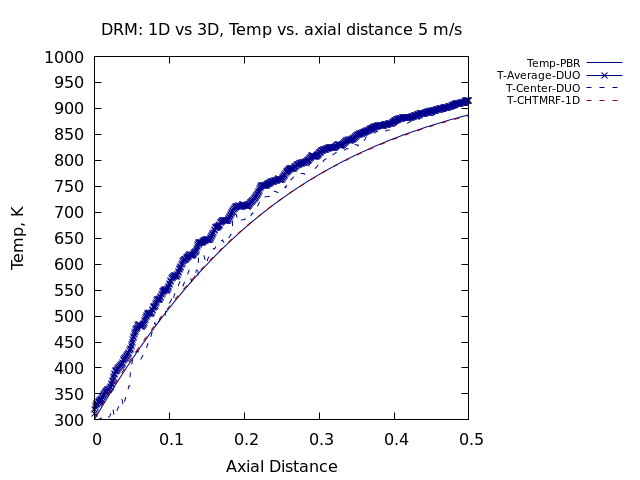
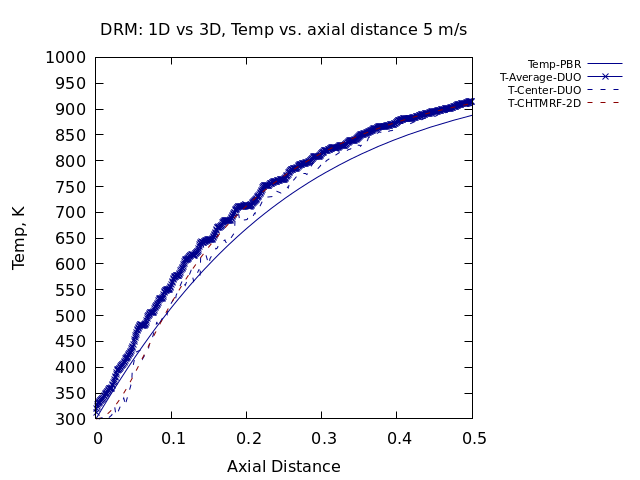

# 1D and 2D porous Media fixed bed reactor simulations with DUO

## 18th OpenFOAM Workshop presentation

Please see the abstract from OFW18 (included in this repo) and the associated slides from the conference.

## Background 

Developments to include porous heat transfer are presented for use with OpenFOAM. DUO is not included (see www.detchem.com for further information about DUO).

Although the code supports transient and steady state, the energy equation is only applicable for steady state calculations (the enthalpy in the d/dt terms should be based on Cp effective, but it's actually based on the fluid Cp in these cases).

## Source code

### chtMultiRegionFoam-porous1D

This solver includes a file called `preCalcEE.H` where effective thermal conductivity for the porous media zone is calculated. Also, if desired, the overall heat transfer coefficient can be calculated, too (e.g., for 1D case).

### heRhoThermoPorous

This thermo model optionally calculates the porous effective thermal conductivity in a single user-specified porous region. Presently the velocity is not read from the fluid region, so to calculate Reynolds number for correlations, a fixed (user-supplied `USuperficial`) value must be used. See the porousProperties file entries below. A future development may be to read the velocity field and calculate the magnitude of U instead of using a fixed value from a file.

### Differences between chtMultiRegionFoam-porous1D and heRhoThermoPorous

If you are using the original unmodified `chtMultiRegonFoam` from OpenFOAM v10, then in `physicalProperties` select the `heRhoThermoPorous` thermo model type instead of `heRhoThermo`. As discussed above, note that when calculating porous heat transfer parameters, a fixed value of U, read from the file `porousProperties` is used. 

Or, alternatively, the solver `chtMultiRegionFoam-porous1D` may be used with the standard `heRhoThermo` model type specified in `physicalProperties`.  The energy equation is modified to use the effective thermal diffusivity calculated in the file `preCalc.H` in the energy equation.

## Compilation

It is assumed that OpenFOAM 10 is installed on your computer, and you have cloned this repository on your local machine.

- `cd heRhoThermoPorous` and then type `wmake` 
- `cd chtMultiRegionFoam-porous1D` and then type `wmake` 

## porousProperties file

```
porousThermalConductivity true; //switch on and off special thermal properties for porous region
USuperficial              10;   // m/s fixed value, only used with detchemHeRhoPorous (not chtMultiRegionFoam-porous1D)

rhoSolid           2250;    // solid density, kg/m3
cPSolid             850;    // solid heat capacity, J/kg/K
kappaSolid            1;    // solid thermal conductivity, W/m/K
porosity          0.635;    // porosity
porousZoneName porosity;    // porous zone name
useOverallU       false;    // use overall heat transfer coefficient within OpenFOAM
useOverallUconst  false;    // calculate overall heat transfer coeffient within OpenFOAM
overallUconst       100;    // constant overall U value, applied only if useOverallUconst true;
diamTube         0.0253;    // tube diameter, m
diamParticle    0.01271;    // particle diameter, m
Twall               973;    // wall temperature, K
```


## Validation cases

### 1D-HeatExchange-5ms
1D heat transfer only case, DUO 3D (86 particles) vs. PBR (1D packed bed reactor solver) and `chtMultiRegionFoam-porous1D`. The new solver matches PBR 1D very closely, and there is a small offset from the 3D packed bed temperature profile. This offset can probably be improved with different correlations for heat transfer properties.




### Wedge-HeatExchange-5ms-use1Dcode
2D heat transfer only case (no reactions), with DUO 3D (86 particles) vs. `chtMultiRegionFoam-porous1D` but without "overallU" (for 1D calculations) enabled. The new solver matches the 3D calculation closely, but note that a fixed wall temperature boundary condition is used. This BC is not ideal, but perhaps is necessary here because the 3D calculations are done on a tube with low N = diameter tube/diameter particle = 2. Normally an externalWallHeatTransfer boundary condition should be used.


### Wedge-HeatExchange-5ms
2D heat transfer only case (no reactions), with DUO 3D (86 particles) vs. `chtMultiRegionFoam` with the custom `heRhoThermoPorous` thermo package used to calculate the effective porous media thermal conductivity. The results matches the 3D calculation closely, but note that a fixed wall temperature boundary condition is used. This BC is not ideal, but perhaps is necessary here because the 3D calculations are done on a tube with low N = diameter tube/diameter particle = 2. Normally an externalWallHeatTransfer boundary condition should be used. Also, the results do not match perfectly with the "use1Dcode" tutorial because a fixed value of superficial velocity must be input in the `constant/<fluidRegion>/porousProperties` file.



 
